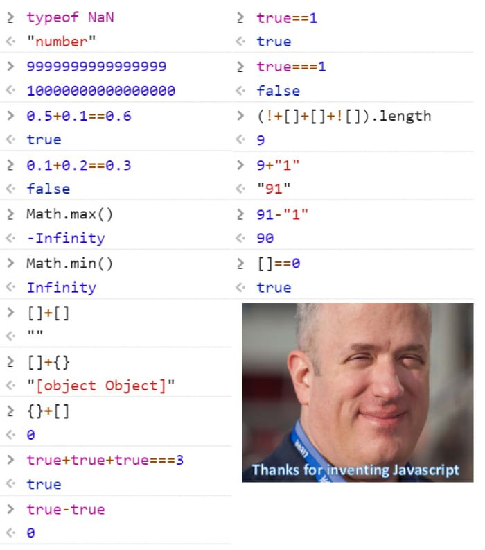

While browsing Twitter, I stumbled across a thread of "controversial opinions" about JavaScript. In one of the replies, I came across this photo:



At first glance it looks like JavaScript has a ton of inconsistencies and people view these as the bad parts of the language. Many folks tend to run away from understanding why things work this way. Well, I'm here to help offer some help in understanding. This photo inspired a Twitter [thread](https://twitter.com/khalalw/status/1198750038647701504) of explanations, but I feel a blog post will be more digestible.

So, with that being said, let's get to it!

---

#### NaN is not-a-number, but it's actually a number?

```javascript
typeof NaN; // "number"
```

Well, yes. `NaN` is a value that represents "not-a-number", but it's a property on the `Number` object which determines `NaN`'s type.

---

#### Floating Point Precision

```javascript
console.log(9999999999999999); // 10000000000000000

0.5 + 0.1 == 0.6; // true

0.1 + 0.2 == 0.3; // false
```

This is something not exclusive to JavaScript. In short, computers use a format that cannot accurately represent 0.1, 0.2, or 0.3. Binary fractions can only represent numbers as a finite fraction where the denominator is a power of 2.

---

#### Math.max() and Math.min() seem to be returning... the opposite?

```javascript
Math.max(); // -Infinity
Math.min(); // Infinity
```

Well, first lets look at an implementation for each of these functions:

###### Math.max

```javascript
Math.max = (...args) => {
  let max = -Infinity;
  for (let i = 0; i < args.length; i++) {
    const val = args[i];
    if (val > max) {
      max = val;
    }
  }
  return max;
};
```

We're setting a maximum value of negative infinity, iterating over each of our arguments and comparing the value to our max. If the current number is greater than our max, it becomes the new max.

###### Math.min

```javascript
Math.min = (...args) => {
  let min = Infinity;
  for (let i = 0; i < args.length; i++) {
    const val = args[i];
    if (val < min) {
      min = val;
    }
  }
  return min;
};
```

Same concept as our last function. Set the minimum to the greatest value (infinity) and iterate over each of our arguments. If the value at the current index is less than our current min, it becomes the new min.

If no arguments are passed into either of these functions, the max and min never change and are `-Infinity` and `Infinity` respectively.

---

#### Weird Math

```javascript
[] + []; // ""
```

When adding two arrays (or objects in general) they are coerced to their primitive (string) values. Let's see an example with non-empty arrays.

```javascript
[1, 2, 3] + [1]; // "1,2,31"

// It's the equivalent of adding "1,2,3" + "1"
```

So for empty arrays, they are first coerced to empty strings. And an empty string plus another empty string equals an empty string.

---

```javascript
[] + {}; // "[object Object]"
```

We know from our last example that arrays and objects are coerced to their string representations. For an empty array, it's an empty string. For the object it's `"[object Object]"`. An empty string added to another string will always return the value of the non-empty string, hence our answer.

---

```javascript
// {} + [] equals 0
// But, lets change how it looks
{
}
+[]; // 0
```

What's actually happening is JavaScript interprets the "object" as a code block. It's an empty code block and an array with the `+` unary operator preceding it. If you're not familiar with the `+` unary operator it coerces the operand to a number. In our case, the empty array's coerced number value is 0.

---

```javascript
true + true + true === 3; // true
```

Boolean values are implicitly coerced to numbers in addition. `true` is 1 and `false` is 0.

1 + 1 + 1 is indeed, 3.

```javascript
true - true; // 0
```

Again, implicit coercion.

1 - 1 is 0.

---

```javascript
9 + '1'; // "91"
```

When a string is encountered during addition, it's no longer a math problem but a string concatenation. So, the 9 is coerced to its string value and added to `"1"`. And voila... `"91"`

```javascript
91 - '1'; // 90
```

Unlike addition, when you use minus sign it is ALWAYS subtraction. It's always a math problem... every single time. The string `"1"` is coerced to its number value and... 91 - 1 is definitely 90.

---

#### Equality

```javascript
true == 1; // true
true === 1; // false
```

In the first example, the loose equality operator `==` allows for type coercion. The boolean `true` is coerced to its number representation, which is 1.

In the second example, no coercion takes place... so true is not equal to 1.

---

#### My Personal Favorites on this list

```javascript
(!+[] + [] + ![]).length; // 9
```

Let's show step by step:

- `(!+[])`: the unary operator `(+)` coerces the empty array into a number, which is 0. The negate operator `(!)` coerces the value into a boolean and flips its value, so we're left with the boolean `true`.
- `(true + [])`: the array is coerced to its string value `""`. What do we know about adding strings? Concatenation. `true` + `""` is equal to the string `"true"`.
- `("true" + ![])`: The negate operator coerces the value to an boolean and flips the value. The coerced boolean value of an array is `true` and it's then flipped to `false`.
- `("true" + false)`: Here we are adding a string and boolean value. From what we already know about adding strings, we're looking at concatenation. `"true" + false` is equal to `"truefalse"`
- `"truefalse".length` is equal to 9, and voila.

---

```javascript
[] == 0; // true
```

In this example, the array is stringified to `""` and then coerced to a number. An empty string's number value is 0 and `0 == 0` is `true`.

---

I hope that this article is able to serve you as a high-level look at how JavaScript coerces types. Some of these do seem very confusing, but they don't have to be. If you'd like to learn more about coercion I'd suggest reading Kyle Simpson's _YDKJS_ series, specifically the _Types and Grammar_ title.
